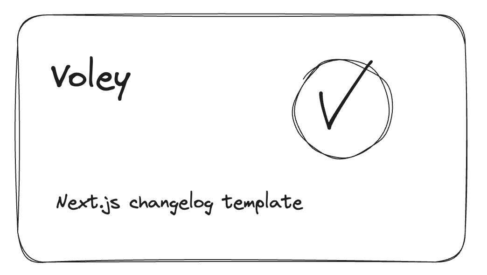

<p align=center > 
  <a href="https://twitter.com/__aadamw" target="_parent">
    
  </a>
</p>

<a href="https://voley.vercel.app">
    
</a>

### 👋 About

Voley is open-source, free, and easy to setup changelog site build with [Next.js](https://nextjs.org/), [tailwindcss](https://tailwindcss.com/), [Drizzle](https://drizzle.team/), [Resend](https://resend.com), [contentLayer](https://www.contentlayer.dev/), [Planetscale](https://planetscale.com/), and [shadcn/ui](https://ui.shadcn.com/) It contains everything you need to get started with changelog site for your project.

### 📦 Features

- 📝 Markdown based posts
- 📱 Responsive design
- 🎨 Dark/Light mode
- 📈 SEO friendly
- 📊 Analytics
- 📬 Newsletter subscribe/unsubscribe
- 📨 Newsletter sending when new post is published
- 📨 Pre-built email templates
- 🎨 Easy theme and content configuration

### 🚀 Getting Started

1. Forking or cloning the repo

```bash
git clone https://github.com/aadamw/voley.git
```

2. Install dependencies

```bash
pnpm install
```

3. Create a `.env` file similar to [`.env.example`](https://github.com/aadamw/voley/blob/master/.env.example)

4. Pushing DB schema to Planetscale

```bash
pnpm db:push
```

5. Run the development server

```bash
pnpm dev
```

### Configuring Voley

You can configure Voley by editing the `config/site-config.ts` file You can change the following options:

#### Site Config:

- `title` - The title of the site
- `description` - The description of the site
- `url` - will be taken automatically from `VERCEL_URL` environment variable or you can set it manually
- `twitterHandle` - The twitter handle of your project

#### Footer items:

- `navigationLinks.title` - The section headers that will be displayed in the footer

- `navigationLinks.items` - The links that will be displayed in the footer for particular headers

- `navigationLinks.socialMediaLinks` - The social media links that will be displayed in the footer (facebook, twitter, github, linkedin) are supported out-of-the-box. You can add more by adding specific icons.

#### Favicons, OG images, and other images:

- `favicon.ico` - update the `app/favicon.ico` file
- `og.png` - update the `public/og.png` file
- `logo.png` - update the `public/logo.png` file (used in the email templates)

### Publishing posts

All posts should be written in markdown and placed in the `./changelog` folder in the root directory. The filename should be the slug of the post in the format `my-post.mdx`. We use [contentLayer](https://www.contentlayer.dev/) to parse the markdown files and generate the data for the posts with typesafety in mind. You can check out the [contentLayer documentation](https://www.contentlayer.dev/docs/getting-started) for more details.

You can check out the [example post](https://github.com/aadamw/voley/blob/master/changelog/introducing-voley.mdx) to see how to format your posts or check [contentLayer.config.ts](https://github.com/aadamw/voley/blob/master/contentlayer.config.ts) file in order to see the types of the data that is generated for each post.

All images should be placed in the `./public` folder in the root directory. You can reference them in the markdown files by using the relative path to the image.

#### Available MDX components

- `Image` - Used to render images in the post. It accepts `src` and `alt` props.
- `Code` - Used to render code blocks in the post. It accepts `code` and `language` props.
- `a` - Used to render links in the post. It accepts `href` prop.
- `Code` - Used to render code blocks in the post.
- `Pre` - Used to render pre blocks in the post.
- `Static Tweet` - Used to render static tweets in the post. It accepts `id` prop. Built with react-twee library

### Deploying to Vercel

The easiest way to deploy this Next.js app is to use the [Vercel](https://vercel.com/new?utm_source=github&utm_medium=readme&utm_campaign=aadamw/voley). Check out Vercel [Next.js deployment documentation](https://nextjs.org/docs/app/building-your-application/deploying) for more details.
